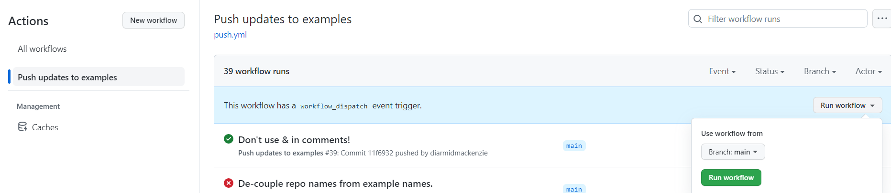

# split-sub-directory


This repository is a proof-of-concept to show how a group of sub-directories of a repository can be mirrored into separate repositories (one per-sub-directory), and then automatically kept in sync via GitHub actions.


This is motivated by a desire to have a better way to manage A-Frame examples, as described here:

https://github.com/aframevr/aframe/issues/5222

We want to master all the code in a single repo, but a per-example repo is very useful as it provides an easy way to spin up a glitch example using https://glitch.new, which [works for whole repos, but not for sub-repos](https://support.glitch.com/t/glitch-new-for-sub-trees-of-github-repos/59049).


### How does it work?

Pretty simple:

- Mirror repos are initially set up by hand - see below for detailed steps.
- On the master repo, we have a [GitHub action](https://github.com/diarmidmackenzie/split-sub-directory/actions/workflows/push.yml) that fires on every push to this repo.
- This checks out the mirror repo, copies the latest files over it, checks for differences, and commits any changes.
- We use [GitHub Deploy keys](https://docs.github.com/en/rest/deploy-keys), with the keys stored as secrets in this repo, to allow GitHub actions in this repo to make changes to the mirror repos.
- We use [webfactory/ssh-agent](webfactory/ssh-agent) to help deal with some of the [less usable aspects](https://github.com/webfactory/ssh-agent#support-for-github-deploy-keys) of GitHub Deploy keys.


Assumptions / Limitations

- Changes are always made in the master repo.  Any changes made in the mirror repo are liable to being overwritten by changes to the master repo.
- There's no need to have a complete version history (check-in comments etc.) in the mirror repos.  Just having code up-to-date is enough.  Check-in comments are always available in the master repo if needed.
- The master repo & mirror repos are all under a single user / organization in GitHub (wouldn't be too hard to change this, but would require a few minor code changes).
- All sub-directories to be mirrored are under a single parent folder
- Because files are copied from master to mirror using a simple copy over, this doesn't handle file deletions & file moves.  For those, you'll need to manually tidy up the mirror repo.


### Repository set-up

#### Setting up a new master

If you have a repository with some sub-folders that you want to mirror to independent repositiories, you need to set up as follows:

- Copy the [`push.yml`](https://github.com/diarmidmackenzie/split-sub-directory/blob/main/.github/workflows/push.yml) file into `.github/workflows` in your repo
- Update the file to reflect the location in your repo of the sub-directories to mirror (`examples-folder`) and the name of your GitHub user / organization (`organization`) - see the `env:` section at the top of that file
- Set up one or more mirror repos, as per the next section, including modifying the `examples:` and `ssh-private-key:` lists, and adding the required Deploy key as a secret in the master repo.
- Test by either pushing an update to the master repo, or using the "Run workflow" button (see image below).  If everything is set up, you should see green checks, and you should also see the latest content replicated





#### Setting up a new mirror

If you have a master repository set up already with some sub-directories mirrored, here's how to mirror another sub-directory.

- If it doesn't already exist, create the content that you want to mirror as a sub-directory within the master repo.

- Create a new blank repo, with the desired name.

- Create a new pair of SSH keys for use as GitHub Deploy keys.  Set the comment on the SSH keys to include the organization and repo name.  This is important as it allows `webfactory/ssh-agent` to choose the right Deploy key for each mirror repo.

  ```
  ssh-keygen -t ed25519 -C "git@github.com:<organization>/<repo name>.git"
  ```

- Add the public key from the key pair as a Deploy key in the repo you just created, and check the "Allow write access" box.  (Settings / Deploy Keys / Add deploy key in GitHub)

- Add the private key from the key pair as a Secret in the master repo (Settings / Secrets & Variables / Actions / new repository secret).  The name you give it doesn't matter too much, as `webfactory/ssh-agent` picks the correct key based on the comment, so if you got that right, you should be good.

- Update the [GitHub Actions Workflow](https://github.com/diarmidmackenzie/split-sub-directory/blob/main/.github/workflows/push.yml) to include this example as one to push, and also include the name of the key you just created.  You need to add the example + the repo name to this list:

  ```
          examples:
            - name: example1
              repo: sample-example1
            - name: example2
              repo: sample-example2
  ```

  and add the new key to this list:

  ```
          with:
            ssh-private-key: |
              ${{ secrets.SSH_PRIVATE_KEY }}
              ${{ secrets.SSH_PRIVATE_KEY_EXAMPLE2 }}
  ```

- That should be it.  You can test the "Push updates to examples" workflow in GitHub Actions using the "Run workflow" button.  If everything is set up, you should see green checks, and you should also see the latest content replicated.


### Troubleshooting

I didn't write any troubleshooting notes yet...  I've worked through a bunch of problems in the development process, but not sure which ones are likely to come up again going forwards, and are therefore worth documenting...

If you hit an error, having followed the instructions carefully (please do check that first!) raise an issue & I'll see if I can help...


### Rejected approaches

Some alternative approaches that I experimented with, but didn't end up using...

- I explored a pull model, where GitHub Actions on the mirror repos pulled changes in.  That avoided some complexity with deploy keys.  It's [quite straightforward](https://github.com/orgs/community/discussions/26323#discussioncomment-3251451) for a GitHub Action on one repo to kick off a GitHub Action on another repo.  Unfortunately, this requires the use of [Personal Access Tokens](https://docs.github.com/en/authentication/keeping-your-account-and-data-secure/creating-a-personal-access-token) which have a maximum lifespan of a year - so can't be used to create a zero-maintenance solution.
- I spent a while experimenting with [git-filter-repo](https://github.com/newren/git-filter-repo) as a way of stripping down the master repo into just the required sub-directory.  This works pretty well, and would have been very useful if I'd wanted to copy the version history from the master repo into the mirror repo.  In the end I decided that wasn't needed, and git-filter-repo was replaced with a simple recursive file copy.

